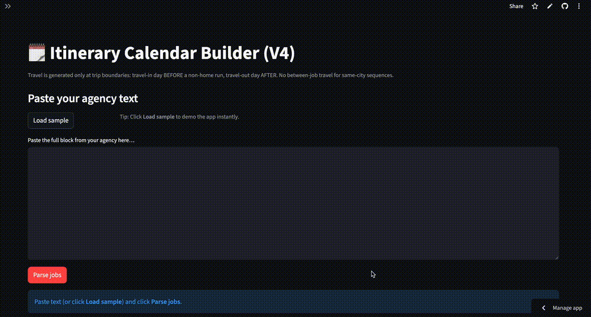

# Pony Rivers — Python + Streamlit Portfolio

## Demo

I build small, practical tools with clean UIs and “instant demo” flows (sample inputs included).

## Live demos

- 🗓️ **Itinerary Calendar Builder** — paste itinerary text → review/edit → export WORK/TRAVEL/HOLD `.ics` calendars (RunID batch delete) 
  **Live:** [Open demo](https://mrponyrivers-itinerary-calendar-builder.streamlit.app/) 
  **Repo:** [View code](https://github.com/mrponyrivers/itinerary-calendar-builder)

- 📄 **RAG PDF Assistant** — local PDF Q&A with source transparency + page citations 
  **Live:** [Open demo](https://mrponyrivers-rag-pdf-assistant.streamlit.app/) 
  **Repo:** [View code](https://github.com/mrponyrivers/rag-pdf-assistant)

- 📄 **Resume Extractor** — extract structured fields from PDF/TXT → JSON + Markdown report 
  **Live:** [Open demo](https://mrponyrivers-resume-extractor.streamlit.app/) 
  **Repo:** [View code](https://github.com/mrponyrivers/resume-extractor)

- 📈 **Odds EV Calculator** — implied probability, fair odds, EV, and Kelly stake sizing 
  **Live:** [Open demo](https://odds-ev-calculator-ponyrivers.streamlit.app/) 
  **Repo:** [View code](https://github.com/mrponyrivers/odds-ev-calculator)

- 🧾 **Tax Buckets** — paste/upload statements → auto-categorize with rules → review → export (Full + QuickBooks bank feed) 
  **Live:** [Open demo](https://mrponyrivers-tax-buckets-app.streamlit.app/) 
  **Repo:** [View code](https://github.com/mrponyrivers/tax-buckets-app)

## What I focus on
- **Local-first** workflows (no external LLM required for core functionality)
- **Clear outputs** (downloads: ICS/CSV/JSON/Markdown/XLSX)
- **Recruiter-friendly demos** (works in ~30 seconds with sample input/files)

## Tech
Python • Streamlit • pandas • pdfplumber • openpyxl • PyPDF • sentence-transformers • embeddings retrieval

## Contact
GitHub: https://github.com/mrponyrivers  
Email: uworshipme888@gmail.com
