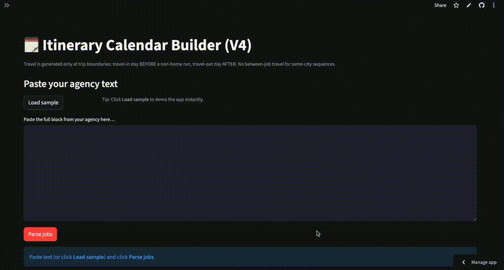

# Pony Rivers — Python + Streamlit Portfolio

## Demo

**AI Workflow Engineer (early career)**  Paris, France 
• Python • Streamlit • Workflow Automation • RAG

I started my AI career journey in **October 2025**. I build small, practical tools in **Python** with clean **Streamlit** UIs — designed to demo in under a minute (sample inputs included).  

Currently studying **Harvard edX**: CS50’s Introduction to Computer Science + CS50’s Introduction to Artificial Intelligence with Python.

---

## YouTube (demos + walkthroughs)

I’m documenting builds and walkthroughs on YouTube: **@PonyRivers-x7i**  
- Channel: https://www.youtube.com/@PonyRivers-x7i  
- Demo: **Portfolio Assets Finder** → https://youtu.be/MYZJR9mZTZ0  
- Demo: **NFL Betting Engine Case Study** → https://www.youtube.com/watch?v=xI88nChjKWU  

If you watch a demo, feedback is welcome — I’m improving clarity and demo flow with each release.

---

## Start here

### 1) Portfolio Assets Finder + Organizer
Structured search → review results → export timestamped run folders (CSV/JSON), optional downloads, plus an Instagram caption pack (links-only by default).  
**Live:** https://mrponyrivers-portfolio-asset-finder.streamlit.app/  
**Repo:** https://github.com/mrponyrivers/portfolio_asset_finder

### 2) Tax Buckets
Categorizes bank statements into business/personal/tax buckets with clean exports for reporting and accountants.  
**Live:** https://mrponyrivers-tax-buckets-app.streamlit.app/  
**Repo:** https://github.com/mrponyrivers/tax-buckets-app

---

## Other shipped apps (live demos)

- 🎯 **Bet Decision Trainer** — practice betting fundamentals: odds (decimal/American) → implied probability → edge/EV → Kelly sizing, plus Trainer drills + CSV backtesting with bankroll curve + drawdown  
  **Live:** https://mrponyrivers-bet-decision-trainer.streamlit.app/  
  **Repo:** https://github.com/mrponyrivers/bet-decision-trainer  
  **Demo:** https://youtu.be/p4s3mTzzzJU

- 🗓️ **Itinerary Calendar Builder** — paste itinerary text → review/edit → export WORK/TRAVEL/HOLD `.ics` calendars (RunID batch delete)  
  **Live:** https://mrponyrivers-itinerary-calendar-builder.streamlit.app/  
  **Repo:** https://github.com/mrponyrivers/itinerary-calendar-builder

- 📄 **RAG PDF Assistant** — local PDF Q&A with source transparency + page citations  
  **Live:** https://mrponyrivers-rag-pdf-assistant.streamlit.app/  
  **Repo:** https://github.com/mrponyrivers/rag-pdf-assistant

- 📄 **Resume Extractor** — extract structured fields from PDF/TXT → JSON + Markdown report  
  **Live:** https://mrponyrivers-resume-extractor.streamlit.app/  
  **Repo:** https://github.com/mrponyrivers/resume-extractor

- 📈 **Odds EV Calculator** — implied probability, fair odds, EV, and Kelly stake sizing  
  **Live:** https://odds-ev-calculator-ponyrivers.streamlit.app/  
  **Repo:** https://github.com/mrponyrivers/odds-ev-calculator

- 🧾 **Tax Buckets** — paste/upload statements → auto-categorize with rules → review → export (Full + QuickBooks bank feed)  
  **Live:** https://mrponyrivers-tax-buckets-app.streamlit.app/  
  **Repo:** https://github.com/mrponyrivers/tax-buckets-app

---

## Featured case study

- 🏈 **Sports odds + decisioning workflow (NFL POWERBOOK)** — end-to-end pipeline from odds normalization → implied probability → EV/Kelly decisioning → logging/settlement → CLV tracking.  
  **Repo:** https://github.com/mrponyrivers/nfl-betting-engine-case-study  
  **Demo video:** https://www.youtube.com/watch?v=xI88nChjKWU

---

## What I focus on
- **Local-first** workflows (no external LLM required for core functionality)
- **Clear outputs** (downloads: ICS/CSV/JSON/Markdown/XLSX)
- **Recruiter-friendly demos** (works in ~30 seconds with sample input/files)
- Turning messy real-world inputs into reliable outputs (structured data, exports, repeatable workflows)
- Shipping “portfolio-ready” apps: docs, demo flow, and deployment

---

## Skills
Python • Streamlit • Git/GitHub • Workflow Automation • ETL • API Integration • Data Cleaning  
CSV/JSON Exports • File-system Pipelines • RAG (Document Q&A) • Deployment (Streamlit Cloud)

---

## Tech
Python • Streamlit • pandas • pdfplumber • openpyxl • PyPDF • sentence-transformers • embeddings retrieval

---

## Contact
GitHub: https://github.com/mrponyrivers
